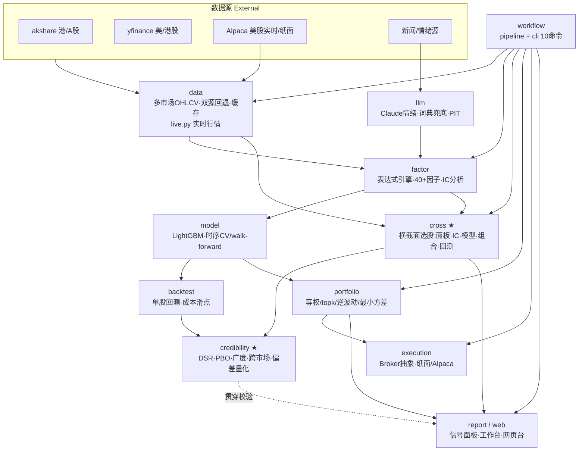
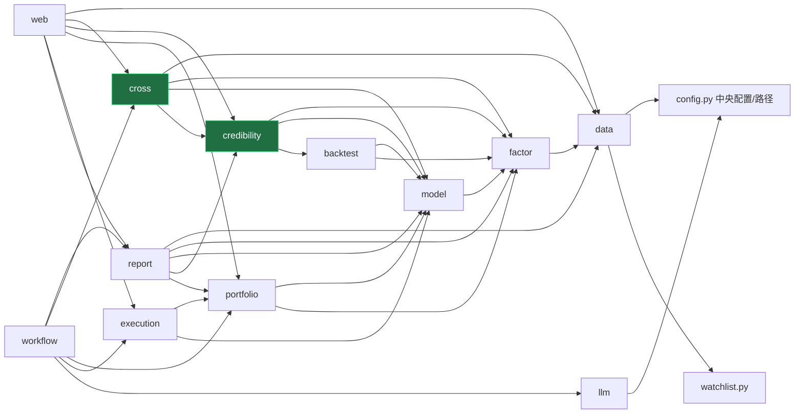
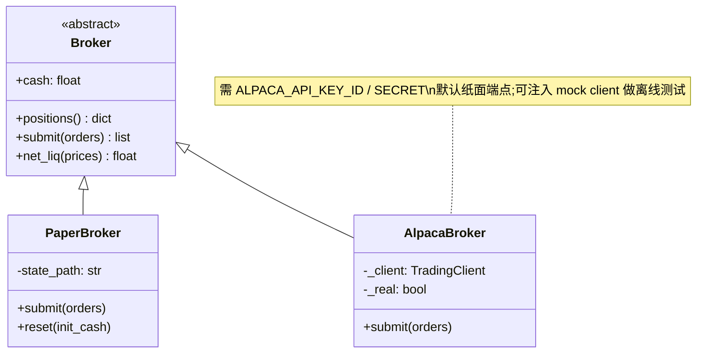
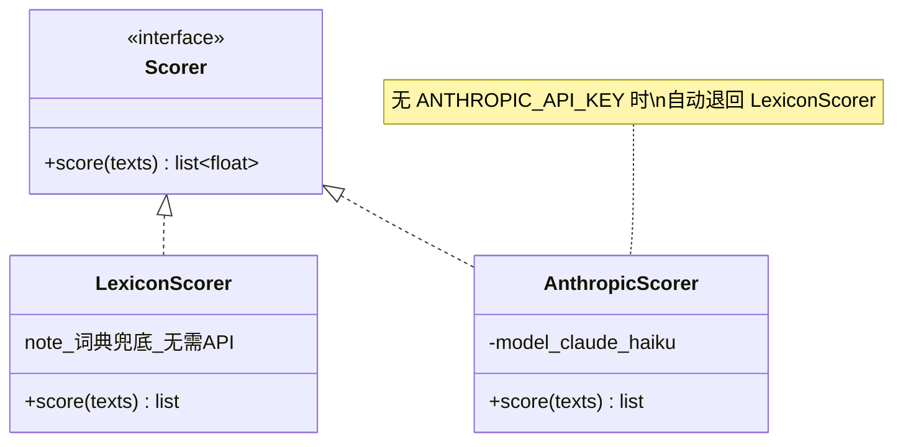
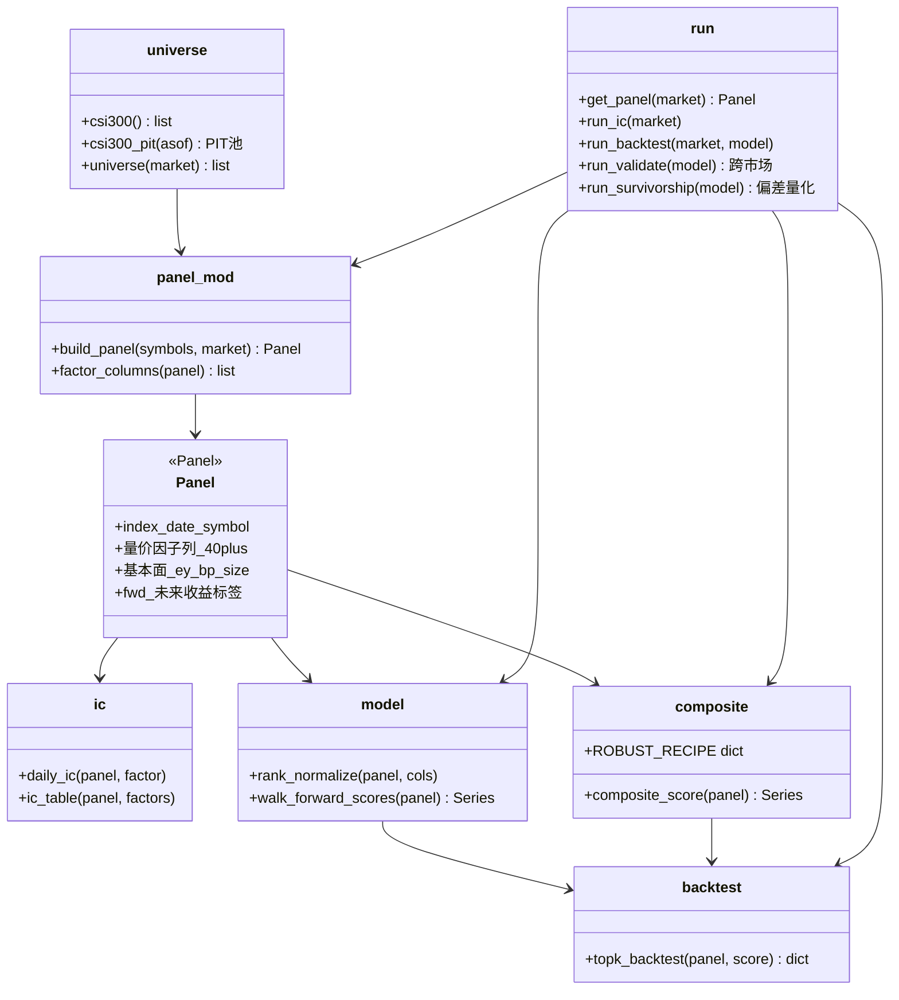
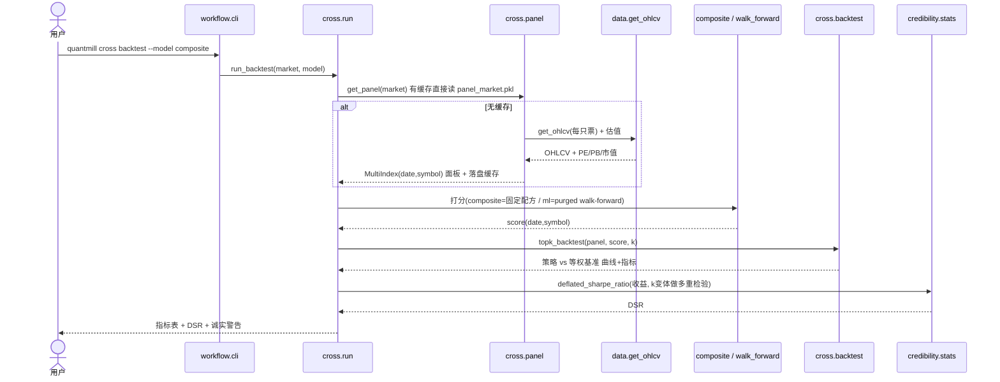
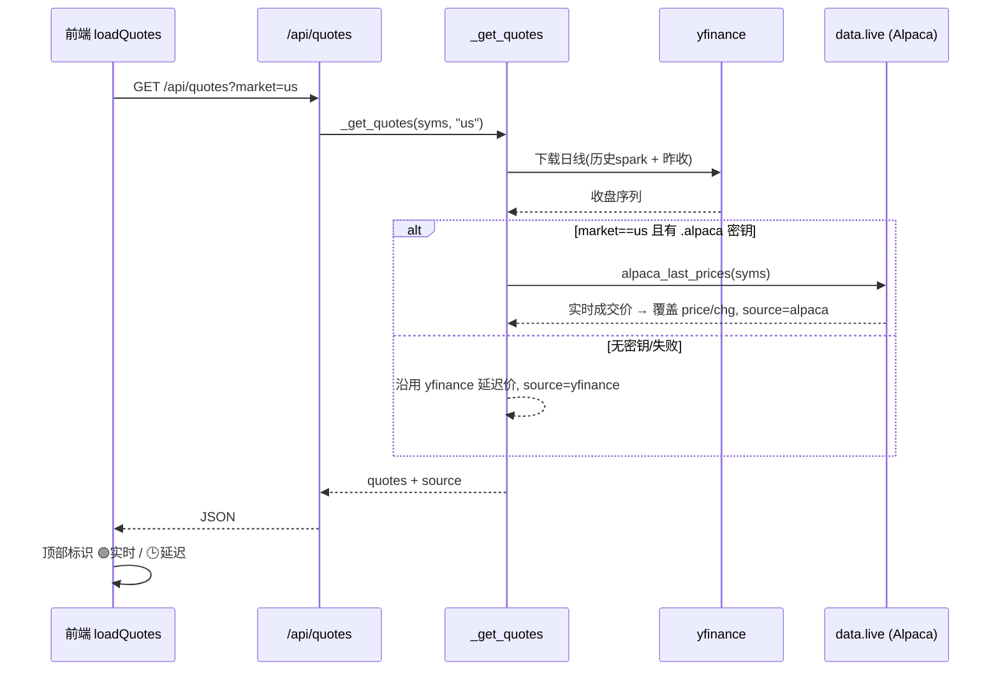
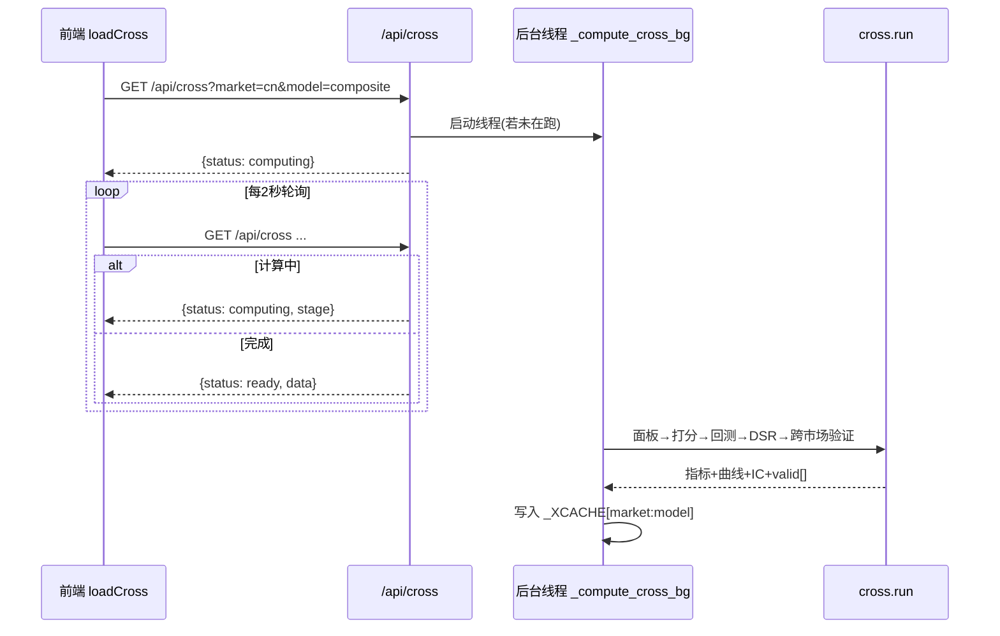
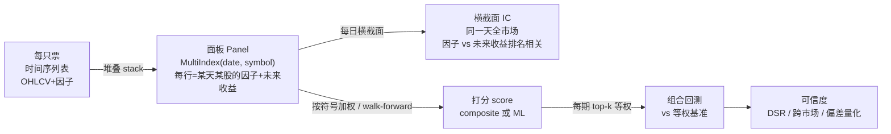

# quantmill 架构与 UML / Architecture & UML

> 本文用 [Mermaid](https://mermaid.js.org) 画图,GitHub 与多数 Markdown 预览器可直接渲染。
> 覆盖:分层架构、模块依赖(组件图)、关键类图、核心流程时序图、数据流。

---

## 1. 分层架构总览 / Layered overview

quantmill 是一条**从数据到执行的全链条**,横切一层**可信度(credibility)**贯穿始终。

**读法**:实线=数据/控制流;`credibility` 是横切关注点(贯穿校验),不是链条末端的一站。

---

## 2. 模块依赖 / Package (component) diagram

> 依赖单向向下,`config` 是所有模块的单一配置来源。护城河模块(绿色)= `credibility` + `cross`。

---

## 3. 关键类图 / Class diagrams

### 3.1 券商抽象(执行层)

### 3.2 情绪打分器(LLM 层)

### 3.3 横截面模块(cross)函数式管线

`cross` 以函数管线为主(非重类),核心数据结构是 **MultiIndex(date, symbol) 面板**:

---

## 4. 核心流程时序图 / Sequence diagrams

### 4.1 `quantmill cross backtest`(横截面选股回测)

### 4.2 网页实时行情(Alpaca 优先,yfinance 兜底)

### 4.3 网页横截面页(后台计算 + 轮询)

---

## 5. 横截面数据流 / Cross-sectional data flow

从"每股单练"到"全市场选股"的范式,数据形态的转变:

**关键区别**:旧路子在 A(单股时序)上建模,学不到"今天买 A 还是 B";`cross` 在 B(横截面面板)上建模,学的是**相对强弱**——这才是选股。

---

## 6. 设计约束 / Invariants

- **无未来函数**:因子只用过去;`fwd` 标签含未来仅用于训练/评估;walk-forward 训练末尾 purge 掉 `horizon` 天。由 `tests/test_cross.py::test_walk_forward_no_future_leak`(砍未来数据不改过去打分)焊死。
- **单一配置源**:所有路径/参数来自 `config.py`。
- **容错退回**:数据源失败自动降级(akshare→yfinance;Alpaca→yfinance;Claude→词典)。
- **缓存**:OHLCV/估值/面板均落盘缓存(`data/`),避免重复拉网。
- **可测试**:所有测试离线、合成数据、确定性;券商/情绪可注入 mock。
